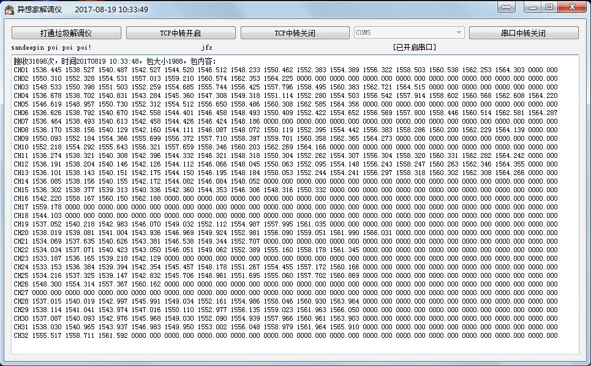

# JfzInterrogator
异想家重写的理工光科解调仪上位机。

### 说明

项目需要从解调仪获取波长数据输入到我们的采集系统，由于不想用它自带的LabView上位机，于是学弟破解了协议，自己在这基础上写了个简单的上位机，纯粹用于采集数据、波长解析。轻装上阵，代替垃圾LabView上位机。

### 功能

* 用UDP协议从解调仪网口接口获取数据
* 波长解析后
* 界面简单显示解析的数据。
* 支持以TCP(本上位机做客户端)的形式和串口形式发送数据给数据采集中心。

### 截图

### 更新日志

#### 2017-08-18

* 完成需要的功能，基本测试稳定。
